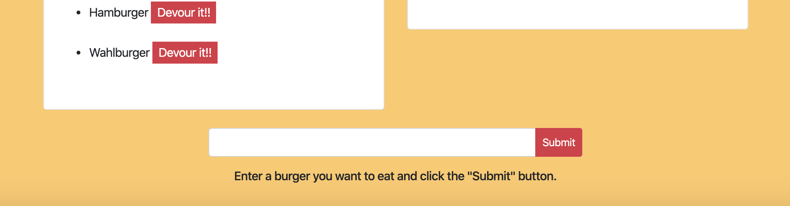

# 13-Node Express Handlebars

## Description

* This app allows you to click the button next to the hamburger you would like and move it to the "devoured" column on the page. It also allows you to enter in the name of whatever kind of burger you would like to add it to the page as well.

* I had some issues with the buttons not working for a while but was able to work around it by looking back through our class activities.

## Link to Repository

* https://github.com/alp13097/13-NEH

## Screenshots

